# Document Relationship Map

## Overview

The folder contains documents for **3 separate import operations**, all handled by the same customs agent (**Patente 3645 - Guillermo Ortega Hurtado de Mendoza / BMA991220B15**).

---

## Mermaid Diagram

```mermaid
graph TB
    subgraph MAIN["OPERATION A: Pedimento 5000103 (MAIN DOCUMENT)"]
        PED["3645_81_5000103_IP_PN_1.pdf<br/><b>PEDIMENTO (Customs Declaration)</b><br/>Importer: SERVIACERO COMERCIAL SA DE CV<br/>Supplier: HOA SEN GROUP (Vietnam)<br/>Goods: Steel sheets/coils (galvanized, Al-Zn)<br/>Aduana: 810 ALTAMIRA<br/>Vessel: FWMERCURY<br/>Value: USD 333,841.52<br/>Total paid: $1,633,664 MXN"]

        VUCEM["278864553.pdf<br/><b>VUCEM Acuse Digitalizacion</b><br/>e-document: 04382514200L5<br/>Type: Bill of Lading<br/>RFC: SCO8007138GA"]
    end

    subgraph GROUPB["OPERATION B: Steel Bars - Nueva Incal (Spain) → Altamira"]
        direction TB

        subgraph COMERCIAL_B["Commercial Documents"]
            FV["FV25288.pdf<br/><b>Commercial Invoice FV25/288</b><br/>Nueva Incal → Serviacero Especiales<br/>Steel bars SAE1018<br/>24 bultos, 24,797 kg<br/>USD 28,322.78 CIF Altamira"]

            SES["SES3555 FA.pdf<br/><b>Stamped Invoice Copy</b><br/>(annotated version)"]

            DOCS["DOCS FV25-288 SERVIACERO<br/>(JAYU1098003).pdf<br/><b>Document Compilation Pack</b><br/>Cover letter + Invoice + PL +<br/>Quality Cert + Production Cert +<br/>Insurance + BL"]
        end

        subgraph TRANSPORT_B["Transport Documents"]
            BL_B["BL.pdf<br/><b>CMA CGM Waybill IBC1399710</b><br/>Bilbao → Altamira<br/>Vessel: X-PRESS MULHACEN<br/>Container: JAYU1098003<br/>24 cases, 24,797 kg"]

            BLREV["BL REV.pdf<br/><b>Delivery Order (Revalidado)</b><br/>B/L: IBC1399710<br/>Vessel: APL MINNESOTA<br/>ETA: 12/11/2025<br/>Container: JAYU1098003"]

            EIR["EIR JAYU1098003.pdf<br/><b>Equipment Interchange Receipt</b><br/>Container: JAYU1098003<br/>Empty return 20/11/2025<br/>CMA CGM Mexico"]
        end

        subgraph LEGAL_B["Legal / Customs Documents"]
            CE_B["CE.pdf<br/><b>Carta Encomienda</b><br/>Serviacero Especiales → Patente 3645<br/>B/L: IBC1399710<br/>Aduana: Manzanillo"]

            CARTA318["Carta 3.1.8.pdf<br/><b>Carta 3.1.8 (Value Declaration)</b><br/>Invoice FV25/288<br/>Aduana de Altamira<br/>Total: USD 28,322.78"]

            MV["MV SES3555.pdf<br/><b>Manifestacion de Valor</b><br/>Pedimento: 25-81-3645-5001570<br/>Supplier: Nueva Incal<br/>Value: USD 28,322.78"]

            INSTR["F-BMA-CT-01 HOJA DE<br/>INSTRUCCIONES...xlsx<br/><b>Pedimento Instructions Sheet</b>"]
        end

        subgraph QUALITY_B["Quality / Compliance Documents"]
            CERTPROD["CERTIFICADO PRODUCCION.pdf<br/><b>Production Certificate</b><br/>Steel bars 1018 R.F.<br/>Fraction 7215.50<br/>Nueva Incal → Serviacero Especiales"]

            CERTCAL["Quality Certificates<br/>(inside DOCS compilation)<br/><b>Certificado de Calidad AV25/338</b><br/>Chemical composition + mechanical props"]
        end

        subgraph PERMITS_B["Import Permits (Avisos Automaticos)"]
            AA1["1119C125184334.pdf<br/>CAL. CUADRADO 2 SAE1018<br/>Spain, 1,892 kg"]
            AA2["1119C125184583.pdf<br/>+ 5 more permits<br/>(1119C125184584-588)"]
        end

        subgraph EXCEL_B["Supporting Spreadsheets"]
            CLAS["Copia de AT2501492 -<br/>CLAS. ARANCELARIA<br/>NUEVA INCAL.xlsx<br/><b>Tariff Classification</b>"]
            CARTAXL1["CARTA EXCEL 3.1.8<br/>NUEVA INCAL.xlsx"]
            CARTAXL2["CARTA EXCEL 3.1.8 -<br/>SES3555 Y SES3557.xlsx"]
        end
    end

    subgraph GROUPC["OPERATION C: Paraffin Wax - Norbright (China) → Manzanillo"]
        direction TB

        subgraph COMERCIAL_C["Commercial Documents"]
            INV_C["26EZ705 INV.pdf<br/><b>Commercial Invoice 26EZ705</b><br/>Norbright Industry → DISOSA<br/>Paraffin Wax FR 58, 28.75 MT<br/>USD 32,803.75 CIF Manzanillo"]

            PL_C["26EZ705 PL.pdf<br/><b>Packing List</b><br/>575 bags, 29,037.5 kg"]
        end

        subgraph TRANSPORT_C["Transport Documents"]
            BL_C["26EZ705 BL.pdf<br/><b>ONE B/L ONEYDLCG00246800</b><br/>Dalian → Manzanillo<br/>Vessel: HMM DAON 020W<br/>Container: TTNU8246386<br/>575 bags, 29,037.5 kg"]
        end

        subgraph QUALITY_C["Quality / Insurance"]
            COA["26EZ705 COA.pdf<br/><b>Certificate of Analysis</b><br/>Norbright Industry<br/>Melting point: 58.15C<br/>Oil content: 0.61%"]

            COAF["26EZ705 COA-F.pdf<br/><b>Factory COA (Chinese)</b><br/>PetroChina Fushun<br/>Batch: 20260107206"]

            INS["26EZ705 INS.pdf<br/><b>Cargo Insurance (PICC)</b><br/>USD 36,084.13<br/>All Risks"]
        end

        subgraph LEGAL_C["Legal Documents"]
            CE_C["CARTA ENCOMIENDA ONE.pdf<br/><b>Carta Encomienda</b><br/>DISOSA → Patente 3645<br/>B/L: ONEYDLCG00246800<br/>Aduana: Manzanillo"]

            CARTA318C["CARTA 3 1 8 Norbright<br/>Industry.docx<br/><b>Carta 3.1.8</b>"]
        end

        subgraph PHOTOS_C["Product Photos"]
            PHOTOS["WeChat images (5 files)<br/><b>Product/shipment photos</b><br/>微信图片_2026011*.jpg"]
        end
    end

    subgraph SCANS["Scanned Documents"]
        SCAN1["escaneo...10-14-45.pdf<br/><b>Scanned docs batch 1</b>"]
        SCAN2["escaneo...10-15-42.pdf<br/><b>Scanned docs batch 2</b>"]
    end

    subgraph AGENT["SHARED: Customs Agent"]
        AGENTE["<b>Patente 3645</b><br/>Guillermo Ortega Hurtado de Mendoza<br/>BMA991220B15<br/>Consorcio Aduanal del Bajio S.C."]
    end

    %% Connections to Main Pedimento
    PED -->|"e-document 04382514200L5<br/>listed in pedimento ED codes"| VUCEM

    %% Operation B internal connections
    FV --> SES
    FV --> DOCS
    BL_B --> BLREV
    BL_B --> CE_B
    BL_B --> EIR
    FV --> CARTA318
    FV --> MV
    FV --> CERTPROD
    FV --> CERTCAL
    AA1 --> AA2
    CLAS --> AA1
    CARTAXL1 --> CARTA318
    CARTAXL2 --> CARTA318
    FV --> INSTR

    %% Operation C internal connections
    INV_C --> PL_C
    INV_C --> BL_C
    INV_C --> COA
    COA --> COAF
    INV_C --> INS
    BL_C --> CE_C
    INV_C --> CARTA318C
    INV_C --> PHOTOS

    %% Shared agent connections
    AGENTE ===|"handles all 3 operations"| PED
    AGENTE ===|"Pedimento 5001570"| FV
    AGENTE ===|"pending pedimento"| INV_C

    %% Cross-operation notes
    PED -.-|"SAME aduana (Altamira)<br/>SAME agent (3645)<br/>DIFFERENT supplier & goods"| FV
    FV -.-|"DIFFERENT importer<br/>DIFFERENT aduana<br/>SAME agent (3645)"| INV_C

    %% Scans
    SCAN1 -.-|"scanned supporting<br/>documents for VUCEM"| AGENTE
    SCAN2 -.-|"scanned supporting<br/>documents for VUCEM"| AGENTE

    style PED fill:#ff6b6b,stroke:#333,stroke-width:3px,color:#fff
    style AGENTE fill:#ffd93d,stroke:#333,stroke-width:2px
    style MAIN fill:#ffe8e8,stroke:#ff6b6b,stroke-width:3px
    style GROUPB fill:#e8f4e8,stroke:#4caf50,stroke-width:2px
    style GROUPC fill:#e8e8f4,stroke:#3f51b5,stroke-width:2px
```

---

## Summary Table

| Document | Type | Connected To | Operation |
|----------|------|-------------|-----------|
| **3645_81_5000103_IP_PN_1.pdf** | **PEDIMENTO (MAIN)** | - | **A: HOA SEN GROUP** |
| 278864553.pdf | VUCEM Acuse | **Pedimento** (ED code 04382514200L5) | A |
| FV25288.pdf | Commercial Invoice | Operation B hub | B: NUEVA INCAL |
| SES3555 FA.pdf | Stamped Invoice | FV25288 | B |
| DOCS FV25-288...pdf | Doc compilation | FV25288 + all B docs | B |
| BL.pdf | Bill of Lading IBC1399710 | FV25288, Container JAYU1098003 | B |
| BL REV.pdf | Delivery Order | BL.pdf (revalidation) | B |
| CE.pdf | Carta Encomienda | BL IBC1399710, Agent 3645 | B |
| CERTIFICADO PRODUCCION.pdf | Production Cert | FV25288 | B |
| Carta 3.1.8.pdf | Value Declaration | FV25288, Aduana Altamira | B |
| MV SES3555.pdf | Manifestacion Valor | Pedimento 5001570 | B |
| EIR JAYU1098003.pdf | Container Return | Container JAYU1098003 | B |
| 1119C125184334.pdf | Import Permit | Steel bars, Spain | B |
| 1119C125184583-588.pdf (x6) | Import Permits | Steel bars, Spain | B |
| CARTA EXCEL 3.1.8 NUEVA INCAL.xlsx | Value Excel | Carta 3.1.8 | B |
| CARTA EXCEL 3.1.8 SES3555...xlsx | Value Excel | Carta 3.1.8 | B |
| Copia de AT2501492...xlsx | Tariff Class. | Permits | B |
| F-BMA-CT-01...xlsx | Instructions | Pedimento prep | B |
| 26EZ705 BL.pdf | Bill of Lading | Invoice 26EZ705 | C: NORBRIGHT |
| 26EZ705 INV.pdf | Commercial Invoice | Operation C hub | C |
| 26EZ705 PL.pdf | Packing List | Invoice 26EZ705 | C |
| 26EZ705 COA.pdf | Certificate of Analysis | Invoice 26EZ705 | C |
| 26EZ705 COA-F.pdf | Factory COA (CN) | COA (source lab report) | C |
| 26EZ705 INS.pdf | Cargo Insurance | Invoice 26EZ705 | C |
| CARTA ENCOMIENDA ONE.pdf | Carta Encomienda | BL ONEYDLCG00246800, Agent 3645 | C |
| CARTA 3 1 8 Norbright Industry.docx | Value Declaration | Invoice 26EZ705 | C |
| 微信图片_*.jpg (x5) | Product Photos | Paraffin wax shipment | C |
| escaneo_*.pdf (x2) | Scanned Docs | VUCEM digitization | Shared |

---

## Key Relationships

### Operation A (MAIN PEDIMENTO) - HOA SEN GROUP
- **Importer:** SERVIACERO COMERCIAL SA DE CV (RFC: SCO8007138GA)
- **Supplier:** HOA SEN GROUP, Vietnam
- **Goods:** Galvanized steel sheets, Al-Zn coated coils (fractions 72104999, 72106101, 72107002)
- **Port:** Altamira | **Vessel:** FWMERCURY
- **Only 1 supporting doc in folder:** VUCEM acuse (278864553.pdf)

### Operation B - NUEVA INCAL Steel Bars
- **Importer:** SERVIACERO ESPECIALES SA DE CV (RFC: SES7402068M2)
- **Supplier:** Nueva Incal S.A.U., Spain
- **Goods:** Cold finished steel bars SAE1018 (fraction 72155011)
- **Port:** Altamira | **Vessel:** X-PRESS MULHACEN | **Container:** JAYU1098003
- **B/L:** IBC1399710 | **Invoice:** FV25/288 | **Pedimento:** 25-81-3645-5001570
- **Most documents in the folder belong to this operation**

### Operation C - NORBRIGHT Paraffin Wax
- **Importer:** DISTRIBUIDORA DE SOSA Y ACIDOS SA DE CV (RFC: DSA120213M87)
- **Supplier:** Norbright Industry Co., Ltd, China
- **Goods:** Paraffin Wax FR 58 (575 bags, 28.75 MT)
- **Port:** Manzanillo | **Vessel:** HMM DAON 020W | **Container:** TTNU8246386
- **B/L:** ONEYDLCG00246800 | **Invoice:** 26EZ705

### Common Thread
All three operations share **Customs Agent Patente 3645** (Guillermo Ortega Hurtado de Mendoza / Consorcio Aduanal del Bajio).
